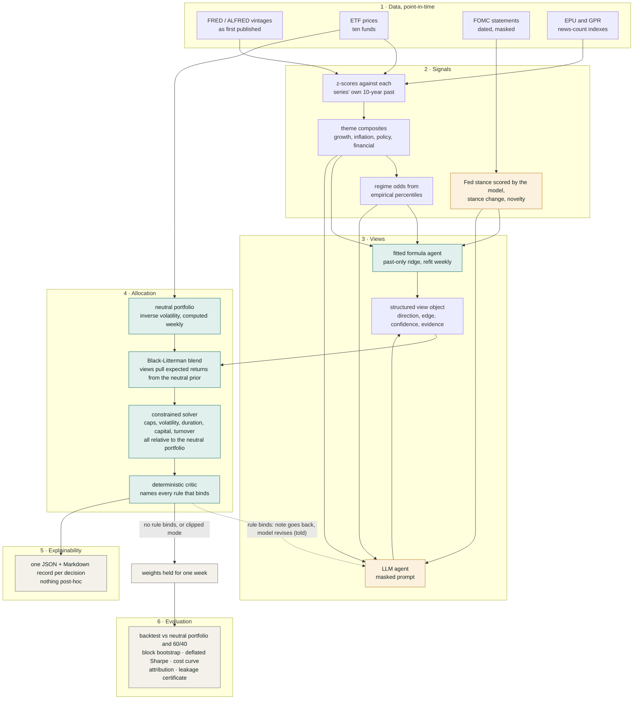

# Finorchestra

Macro-financial portfolio intelligence, built to be believed: point-in-time signals, a fitted formula agent and an
LLM agent, Black-Litterman into a deterministically constrained optimizer, a constraint feedback loop back to the
reasoner, and an evaluation harness designed around the ways this kind of system usually fools its authors. Every
modelling number is either estimated from data, taken from a public source, or listed with its basis in the run
certificate and in `docs/assumptions-register.md`.

Duke CAP2027 Team 4 for BNY AI Hub. Public data only.

## How one week flows through the system

Every Friday the same six layers run, using only what was public that day. Amber marks the two places a language
model is involved: scoring each Fed statement's stance (once per statement, cached) and forming the views.
Everything else is deterministic and inspectable. The dashed edge is the project's new idea: when a rule binds, the
critic's one-sentence note goes back to the model, which revises, up to two rounds (the "told" strategy). The
"clipped" strategy takes the same first views and lets the solver trim them without telling the model.



Three strategies are scored side by side each week: the fitted formula, the LLM clipped, and the LLM told. Two
yardsticks sit beside them, the neutral portfolio itself and a 60/40 mix.

## Quickstart

Requirements: [uv](https://docs.astral.sh/uv/) (any Python 3.11 to 3.13 works; the scripts pick 3.13).

```bash
# everything: environment, data pull, tests, full backtest with the offline mock model
bash scripts/run_all.sh                     # macOS / Linux / Git Bash
powershell -File scripts/run_all.ps1        # Windows PowerShell
```

Or step by step:

```bash
uv venv --python 3.13 .venv && uv pip install --python .venv -e ".[dev]"
.venv/Scripts/python -m finorchestra.cli pull            # 20-30 min first time (about 380 ALFRED calls at ~4 s each); cached after
.venv/Scripts/python -m pytest tests -q
.venv/Scripts/python -m finorchestra.cli run             # weekly backtest 2015 -> latest
.venv/Scripts/python -m finorchestra.cli decide --date 2024-03-15
.venv/Scripts/python -m finorchestra.cli leakage-check --date 2022-06-17
```

Outputs land in `outputs/runs/<run_id>/`: `report.md`, `summary.json`, `certificate.json`, `decisions/*.json`,
`latest_decision.md`, weights and returns CSVs, `cumulative.png`, `weights_*.png`, `regimes.png`,
`incremental_test.csv`, and `dashboard.html`. The run id is a hash of the resolved config, so identical settings
reproduce identical ids.

## Dashboard

Every run writes `dashboard.html`, a single self-contained page (no server, no external requests, no library) with
the run's data embedded. It is laid out as a guided read for a non-specialist, one question per section, each with
a plain-language takeaway sentence generated from the numbers: a "Start here" panel naming the three players and the
yardsticks; the verdict (Sharpe as "reward per unit of risk", with each pairwise difference and its luck check);
growth of one dollar; worst falls from a peak; a dedicated section on the new idea (how often the first proposal hit
a rule, how often the revision cleared it, feedback vs clipped with its p-value, and a real before/after revision);
what the chosen player held against each cap; whether it stayed inside the risk, duration and capital limits; a
"pick a week and read the reasoning" explorer showing exactly what was recorded that week; and the luck and
attribution checks. Rolling Sharpe, the cost curve, regimes, theme z-scores, the incremental information test, the
deflated Sharpe and the certificate sit in a collapsed "For the quants" section. A period filter and a player
selector scope every view; technical terms carry hover definitions; every chart has a table twin and keyboard-readable
crosshairs; light and dark themes are both designed. Rebuild it for any finished run with
`finorchestra dashboard --run-dir outputs/runs/<run_id>`.

## Swapping in a real language model

The LLM layer speaks the OpenAI chat-completions protocol and nothing else. Set three things:

| Backend | `--base-url` | `--model` | key env `FINORCHESTRA_LLM_API_KEY` |
|---|---|---|---|
| Ollama (local, tested) | `http://localhost:11434/v1` | `qwen2.5:3b` (or any pulled model) | anything |
| OpenAI | `https://api.openai.com/v1` | `gpt-4o-mini`, ... | your key |
| Cloudflare Workers AI | `https://api.cloudflare.com/client/v4/accounts/<ACCOUNT_ID>/ai/v1` | `@cf/meta/llama-3.1-8b-instruct` | API token |
| Amazon Bedrock | URL of an OpenAI-compatible gateway (Bedrock Access Gateway, LiteLLM) | gateway model id | gateway key |
| OpenRouter | `https://openrouter.ai/api/v1` | `<provider/model>` | your key |

```bash
# keys are read from a .env file in the project root (OPENAI_API_KEY is picked up automatically for api.openai.com)
.venv/Scripts/python -m finorchestra.cli run --llm openai_compatible --base-url https://api.openai.com/v1 \
    --model gpt-4.1-mini --knowledge-cutoff 2024-06-01 --start 2024-07-05 --name openai-postcutoff

# local model, no key needed
.venv/Scripts/python -m finorchestra.cli run --llm openai_compatible --model qwen2.5:3b \
    --base-url http://localhost:11434/v1 --start 2026-06-05 --name ollama-smoke
```

Pass `--knowledge-cutoff` (or set `llm.knowledge_cutoff`) to the model's documented training cutoff; the certificate
reports how many decision dates fall after it, and `--start` just after the cutoff gives a slice the model cannot
have memorised. Reasoning-model families (gpt-5, o-series) reject an explicit temperature; the client omits it for
them. Default provider is `mock`: a deterministic, offline stand-in that applies a transparent regime playbook so
the full pipeline runs and reproduces bit-for-bit without keys. The mock is not a language model and every report
says so.

## What is where

```
configs/default.yaml           every remaining modelling choice in one file (universe kinds, mandate placeholders, evaluation)
src/finorchestra/
  data/fred.py                 ALFRED vintage reconstruction -> (obs_date, value, realtime_start, realtime_end)
  data/market.py               ETF adjusted closes, weekly returns, shrunk covariance
  data/text_indices.py         EPU (via FRED) and GPR daily with availability lags
  data/fomc.py                 FOMC statement scraper, one dated file per statement (2007 ->)
  data/pit.py                  PointInTimeStore.snapshot(d): the only door to data; .truncated(d) for the leakage test
  signals/zscores.py           derived macro series, trailing past-only z-scores, theme composites
  signals/regime.py            growth x inflation quadrant probabilities from empirical percentiles (no parameter)
  signals/text_signal.py       Fed stance (LLM or lexicon) and novelty (TF-IDF); cached per statement
  signals/retrieval.py         BM25 x recency over statements, hard date filter
  signals/incremental.py       does our text signal add information beyond EPU/GPR/z-scores? (HAC regressions)
  llm/client.py                OpenAI-compatible client with JSON schema validation, retries, fallback accounting
  llm/mock.py                  deterministic offline model
  views/schema.py              the structured view object (pydantic)
  views/masking.py             tickers -> Asset A/B, dates -> [date]/t-k weeks
  views/fitted_agent.py        past-only ridge regression from signal features to views, refit weekly
  views/llm_agent.py           prompt construction, proposal, and constraint-feedback revision
  allocation/benchmark.py      the data-derived neutral portfolio (inverse-vol over risky funds)
  allocation/duration.py       empirical fund durations from returns vs the 10-year yield
  allocation/black_litterman.py
  allocation/constraints.py    mandate relative to the neutral portfolio, 12 CFR 217 risk weights, the deterministic critic
  allocation/optimizer.py      cvxpy (CLARABEL/SCS) with graceful relaxation
  allocation/engine.py         clip vs feedback modes, revision history
  evaluation/metrics.py        Sharpe, deflated Sharpe, cost curve, block bootstrap, HAC attribution
  evaluation/baselines.py      benchmark (the neutral portfolio) and 60/40
  evaluation/leakage.py        contamination certificate; deep-compare for the no-look-ahead test
  explain/report.py            decision Markdown/JSON, run report, figures
  explain/dashboard.py         self-contained interactive dashboard.html per run
  pipeline.py                  decide(d) and backtest()
  cli.py                       pull / run / decide / leakage-check / dashboard / data-summary
tests/                         35 unit tests (pure components) + 4 integration tests on the real store
docs/                          first-principles guide, system walkthrough, RL / Fed-reuse scope note, assumptions register, worked example
data/raw/                      inputs (see data/raw/README.md); processed caches in data/processed/
```

## Design commitments

**Point-in-time or nothing.** Official statistics are stored as real-time intervals reconstructed from weekly
ALFRED vintages (or exact ones with a FRED API key). A decision at date D sees the value published on the
latest Friday <= D. Daily market series (effective fed funds, yields, VIX) are posted the next business day and
carry that lag; a monthly-average series is never used as a same-day input. Text indices carry availability lags.
FOMC statements are dated by release. Prices are total-return adjusted closes, and only returns enter the model,
so later dividend rescaling cannot leak. `leakage-check` deletes everything knowable after D and asserts the
decision is unchanged.

**Shared information, two readers.** The fitted formula agent is a past-only ridge regression of forward excess
returns on the four theme composites and the three Fed-text features, refit every week with the penalty chosen by
cross-validation; nothing in it is hand-written. The LLM agent sees those same features plus the ten individual
z-scores, the news indices, the regime odds and two retrieved statements. The formula is the floor a reasoner has to
beat; the gap between them is reasoning plus the extra detail the model is shown.

**Propose, then certify.** Views go through Black-Litterman, anchored on a neutral portfolio computed from data each
week (inverse-volatility over the risky funds), into a QP under a mandate expressed relative to that neutral portfolio:
an active-weight band per fund, volatility and regulatory capital at most 1.25x the neutral portfolio's, duration within
two years of it, and a weekly turnover cap. Fund durations are estimated from each fund's own returns against the
10-year yield; capital risk weights follow the US standardised rule (12 CFR 217) by fund kind. The five mandate numbers
are placeholders for the client's own limits and are labelled as such. A deterministic critic re-checks executed weights. In
`llm_feedback` mode the critic also reports which institutional constraints are *binding* on the optimized
portfolio: a pinned cap means the views asked for more than the institution allows and were clipped. Those
messages go back to the agent in plain language ("TLT is pinned at its active-band cap of 24.6%; portfolio duration
is at the band ceiling"), the agent revises, and the loop repeats up to two rounds. `llm_clip` accepts the clipping
silently. The first-pass proposal is shared between the two, so the ablation is clean.

**Regime odds without a dial.** The probability that growth or inflation is "up" is the empirical percentile of the
theme within its own past-only history, so the four-quadrant regime odds have no tuning parameter. They are shown to
the LLM agent and tracked in the report.

**Evaluation that resists flattery.** Deflated Sharpe using the number of strategies run and the dispersion of
Sharpe measured across them (no assumed prior), circular-block-bootstrap p-values on Sharpe differences, Sharpe
at 0 to 30 bp one-way costs charged on every trade including the first, and Barra-style attribution (market /
duration / credit / commodity / dollar) with HAC t-stats and an exact variance split (market, style, covariance,
residual = 1 − R²). Every run writes a contamination certificate: how point-in-time each
input is, model identity, prompt masking, declared knowledge cutoff and the share of dates after it,
fallbacks to the mock, and trial count.

## Results of the reference run (mock model, 2015-01-02 to 2026-09-04, 610 weekly rebalances)

Run `mock-full-v3-02621a1e`, produced under revision 2 (data-derived neutral portfolio, estimated durations,
regulatory risk weights, fitted formula agent, empirical regime percentiles, Ledoit-Wolf constant-correlation
shrinkage) after the two defect fixes below. The earlier runs `mock-full-b811156c` (version 1) and
`mock-full-v2-e375a7e8` (revision 2 with a scaled-identity shrinkage target that inflated low-risk funds' variance,
withdrawn) are kept for the record.

| strategy | ann. return | ann. vol | Sharpe | max DD | turnover/wk | Sharpe @30bp | alpha/yr (t) |
|---|---|---|---|---|---|---|---|
| rule (fitted) | +2.3% | 5.9% | 0.09 | -14.7% | 9.3% | -0.15 | -1.1% (-1.0) |
| llm_clip | +4.6% | 4.8% | 0.57 | -7.2% | 3.7% | 0.45 | +2.3% (2.4) |
| llm_feedback | +3.8% | 4.9% | 0.39 | -11.7% | 6.2% | 0.19 | +1.5% (1.7) |
| benchmark (neutral portfolio) | +4.0% | 5.0% | 0.43 | -11.7% | 0.5% | 0.41 | +0.6% (1.3) |
| sixty_forty | +8.9% | 10.1% | 0.71 | -20.8% | 0.2% | 0.70 | -0.0% (-0.0) |

No pairwise Sharpe difference among the three strategies or against the neutral portfolio is distinguishable from
zero (block-bootstrap p-values 0.08 to 0.87). Two things changed visibly against the first version. The fitted
formula agent is weak (Sharpe 0.09, turnover 9.3% a week): a ridge regression on seven weekly features finds little
that is stable, and the hand-written loadings it replaced (Sharpe 0.61 in version 1) had encoded textbook relations
the data does not confirm over this decade. That is the honest floor now. And the feedback loop fires on 593 of 610
weeks (97%) because the mandate is expressed as an active band around the neutral portfolio, which the mock's
playbook views press against almost every week (the dollar and gold bands, the duration floor and the volatility
allowance most often); revision cleared every binding rule on 49 weeks. Zero critic violations, zero turnover
relaxations. The incremental information test finds a small negative relation between hawkish Fed stance and forward
equity returns (SPY: t = -2.1 at 4 weeks; HYG: -2.0) and nothing for Treasuries. Full report:
`outputs/runs/mock-full-v3-02621a1e/report.md`.

**Re-verification (2026-09-07).** A 26-agent adversarial pass executed code against every claim in this README, the
docs and the run report (about 60 claims; scratch scripts in `outputs/verify_scratch/`). Every documented number
reproduced. It also found real defects, all fixed before the run above: the monthly-average fed funds series was
dated the first of its month and so leaked mid-month rate decisions into the policy signal (replaced by the daily
effective rate with a one-day lag, and every daily market series now carries that lag); the turnover series never
charged the initial trade; the attribution variance split dropped covariance terms; the deflated-Sharpe dispersion
prior was undisclosed; and the prompt masker garbled fractional rate ranges. A follow-up check found that 51 of
the 166 stored Fed statements carried mis-decoded non-ASCII characters from the scraper (repaired at load time and
in the scraper). The pre-fix run (not retained) had Sharpe 0.67 / 0.70 / 0.63 for the three version-1 strategies, so the leak
flattered the version-1 rule agent by about 0.06. Run directories are never overwritten: a re-run with an unchanged config gets an `-r2`
suffix, because the run id hashes the config, not the data.

**Assumptions sweep (2026-09-07, later).** Every modelling choice was catalogued with its basis and a one-week
sensitivity in `docs/assumptions-register.md` (162 items; 77 had no recorded reason). The sweep's completeness check
found two defects, both fixed with regression tests and *after* the runs quoted above: the mock proposer's revision
handler matched "Asset C" inside the words "single-asset cap" and so halved the mid-Treasury view on every cap
message (mock runs only), and the prompt masker rounded "1/4 percentage point" to 0.5 and collapsed "5-1/4 to 5-1/2
percent" into a single point (every model prompt; move sizes are now left alone and ranges widened outward). Both
reference runs were then re-run under revision 2; the tables in this README are from the new runs.

**Real-model smoke tests.** Two 14-week runs (2026-06-05 to 2026-09-04, every date after both models' declared
cutoffs) completed with zero schema failures, zero fallbacks and zero critic violations. Local `qwen2.5:3b` via
Ollama (run `ollama-smoke-35f09d83`): 42 calls at about 51 s each; its first-pass views hit a limit on all 14 dates
and revision never cleared one. `gpt-4.1-mini` via the OpenAI API (run `openai-smoke-c9e172b2`): 40 calls at about
10 s each, 7 minutes in total; its evidence cites the signal values it used, first-pass views bound on 12 of 14
dates, and revision cleared every binding constraint on 5 of them ("to comply with the portfolio duration floor of
2.0 years, the underweight on government bonds is reduced to neutral"). Fourteen weekly returns say nothing about
performance; the bootstrap refuses to compute p-values on them.

**Post-cutoff real-model run** (`openai-postcutoff-v3-3baad69b`, revision 2). `gpt-4.1-mini` on all 114 weeks from
2024-07-05 to 2026-09-04, every one after its declared June 2024 cutoff, so memorisation cannot help it. 261 calls at
about 6.5 s each (31 minutes, about 43 US cents at list prices), zero schema failures, zero fallbacks, zero critic
violations, zero turnover relaxations. Earlier runs are kept for the record: `openai-postcutoff-aefba080` (version 1,
hand-set weights and fixed caps) and `openai-postcutoff-v2-c2d35cef` (revision 2 with a scaled-identity shrinkage
target that inflated low-risk funds' variance, withdrawn).

| strategy | ann. return | ann. vol | Sharpe | max DD | turnover/wk | Sharpe @30bp | alpha/yr (t) |
|---|---|---|---|---|---|---|---|
| rule (fitted) | +12.4% | 5.4% | 1.42 | -3.5% | 10.2% | 1.13 | +3.7% (1.8) |
| llm_clip | +5.7% | 4.7% | 0.34 | -3.8% | 16.2% | -0.20 | +0.1% (0.0) |
| llm_feedback | +7.0% | 4.5% | 0.62 | -3.0% | 16.4% | 0.05 | +1.6% (0.8) |
| benchmark (neutral portfolio) | +7.1% | 3.7% | 0.76 | -2.9% | 1.2% | 0.71 | +1.3% (1.5) |
| sixty_forty | +11.9% | 9.3% | 0.82 | -9.0% | 0.9% | 0.80 | +0.5% (1.2) |

Reading it, and reading it against version 1. Under the data-based design the version-1 headline did not survive:
the model told which rules it broke beats the same model silently clipped by 0.27 Sharpe (bootstrap p = 0.41),
where version 1 had 0.78 (p = 0.03). The mandate changed underneath the loop: an active band around a
risk-balanced neutral portfolio binds differently from fixed 30% caps (the loop fired on 77 of 114 weeks and cleared
every rule on 18), and the gap between the two AI paths is now well inside what luck produces. Neither AI path beats
the neutral portfolio (feedback -0.14, p = 0.67; clipped -0.42, p = 0.28). The fitted formula agent, which scored
0.09 over ten years, scores 1.42 on this two-year slice; it beats the clipped model at p = 0.03, and its edges over
the feedback model (p = 0.10) and the neutral portfolio (p = 0.09) do not clear the usual bar. Read that with the
ten-year number in the same breath: a regression refit weekly can look excellent over one regime and poor over five,
and 114 weeks is not enough to tell skill from a good stretch. The incremental information test flips sign relative
to the ten-year mock run (hawkish stance predicts *higher* forward equity returns here, t +2.6 to +4.8 for SPY),
which is the behaviour of a short-sample estimate, not of a stable signal. The honest one-sentence summary of the
only slice that cannot be memorised, revision 2: the fitted formula did best, neither AI path beat the neutral
portfolio, and the feedback loop's advantage over silent clipping is real in direction but not distinguishable from
luck on this sample.

## Reading results honestly

- With `--llm mock` the "llm" strategies test the architecture (regime playbook, Fed stance, feedback loop),
  not a model. Run a real endpoint for model claims, and prefer the post-cutoff slice.
- Masking removes recall hooks; it cannot make a model forget 2020. Pre-cutoff results from a real LLM are
  upper bounds.
- Sharpe differences of a few hundredths over ten years of weekly data are noise. The bootstrap says so.
- The incremental information test asks whether our Fed-text signal adds anything beyond the 2016 newspaper
  indices. A null result is a finding, not a failure.

## Configuration

All remaining choices live in `configs/default.yaml`: the ETF universe with each fund's kind (which drives the
regulatory risk weight and whether a duration is estimated); FRED series and their availability lags; z-score windows
and theme composition; the fitted agent's horizon, minimum history and penalty grid; the covariance window and risk
aversion; the five mandate placeholders; evaluation grids. Durations, risk weights, the neutral portfolio, the regime
probabilities, the covariance shrinkage and the formula agent's loadings are computed, not configured. Every run's
certificate lists the remaining choices with a basis tag (`data`, `literature`, `judgement`, `PLACEHOLDER`). Override
from the CLI: `finorchestra run` accepts `--start`, `--end`, `--llm`, `--model`, `--base-url`, `--name` and
`--strategies` (`decide` accepts the three model flags), or in code via
`load_config(path, {"allocation.mandate.active_weight_band": 0.2})`.

## Data sources

FRED and ALFRED (St. Louis Fed), Yahoo Finance via `yfinance` for ETF closes, Federal Reserve Board for FOMC
statements, Baker-Bloom-Davis EPU (via FRED), Caldara-Iacoviello GPR (author site). Details and caveats in
`data/raw/README.md`.
