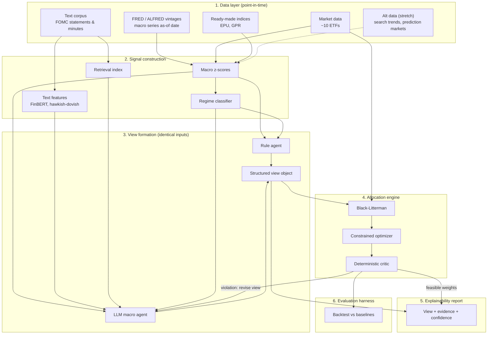

# Finorchestra, Explained From First Principles

> **Written before revision 2.** This explainer describes the first version of the design. Three things changed on 2026-09-07 (see `docs/assumptions-register.md`, section 0): the Fed text now enters as three separate features (stance, stance change, novelty) with no combined stance-times-novelty surprise; the Black-Litterman anchor is a neutral portfolio computed weekly by inverse volatility over the risky funds, not aggregate market holdings; and the baselines are that neutral portfolio plus 60/40. Everything else here still holds.


**Project:** Macro-Financial Portfolio Intelligence System (Duke CAP2027, Team 4, client: BNY AI Hub)
**Audience:** every member of the team, regardless of background. This guide assumes you know some statistics and Python, and nothing at all about finance, economics, or how banks invest money.
**How to read it:** Section 1 explains the problem in ordinary language. Section 2 shows the whole system in one picture. Sections 3 to 8 walk through each layer of that picture, defining every term and acronym the first time it appears. Section 9 says what is borrowed and what is new. Section 10 is a glossary you can return to.

---

## 1. The problem in plain language

### 1.1 What a portfolio is

Imagine you have money you want to keep and grow. You can put it into different kinds of things: shares in companies, loans to governments, gold, oil, foreign currencies. Each of these is called an **asset**, and each broad kind is an **asset class**. The collection of everything you hold is your **portfolio**. The decision of how much money to put in each asset class is called **asset allocation**, or just **allocation**. If you hold 60 percent in company shares and 40 percent in government loans, your allocation is "60/40."

The people who make these decisions for large pools of money, such as pension funds or bank balance sheets, are called **investment professionals** or **portfolio managers**. Our client, **BNY** (the Bank of New York Mellon, one of the oldest and largest banks in the United States, which holds and manages assets for other institutions), employs many of them.

### 1.2 Why the economy matters for allocation

Every allocation decision is secretly a prediction about the economy. Here is why.

- If interest rates go up, existing government loans (called **bonds**) lose value, because new bonds pay more and old ones look worse by comparison.
- If the economy grows fast, companies earn more, so company shares (called **equities** or **stocks**) tend to rise.
- If prices in general are rising fast (**inflation**), assets like gold and commodities often do well, and bonds do badly.
- If a war or political crisis breaks out (**geopolitical risk**), investors rush to "safe" assets like US government bonds, gold, and the US dollar.

So when a portfolio manager decides to hold more bonds and fewer stocks, they are implicitly saying "I think growth will slow and rates will fall." This kind of reasoning about the whole economy, rather than about individual companies, is called **macro** reasoning, short for macroeconomics, the study of the economy as a whole.

### 1.3 What BNY asked us to build

BNY wants to know whether an AI system can do this whole chain of reasoning: read the economic news and data, form an opinion about where the economy is heading, and turn that opinion into a concrete allocation that respects the rules a real bank has to follow. They asked for three things at minimum.

1. **A working pipeline** from raw data to allocation recommendations.
2. **An explainability module** that shows the macro view, the evidence for it, and how confident the system is.
3. **A constraint framework** that enforces real-world rules such as risk limits.

They also listed two optional stretch goals: using unconventional data (internet searches, prediction markets, social media), and experimenting with multi-step AI reasoning.

### 1.4 What a "view" is

Finance people use the word **view** to mean a considered opinion about the future of some asset or economic quantity, such as "I think US interest rates will fall over the next six months" or "I think equities will beat bonds this quarter." A view is not a certainty; it comes with a confidence level. Our system's central job is to form views and turn them into allocations.

---

## 2. The system in one picture



Read it top to bottom. Raw data comes in, gets turned into clean numerical signals, those signals become opinions (views), the opinions become portfolio weights that obey the rules, the whole thing is explained in a report, and everything is tested against simple baselines to see whether it actually works.

The rest of this document walks through each layer.

---

## 3. Layer 1: Data

Everything starts with data. We use only **public** data, meaning anyone can download it for free. This is both a project constraint from BNY and a virtue: anyone can check our work.

### 3.1 FRED: the economic data warehouse

**FRED** stands for **Federal Reserve Economic Data**. It is a free online database run by the Federal Reserve Bank of St. Louis, one of the twelve regional banks that together form the **Federal Reserve** (or "the Fed"), the central bank of the United States. A **central bank** is the institution that controls a country's money supply and sets its key interest rate. Bhutan has the Royal Monetary Authority, Korea has the Bank of Korea, Iran has the Central Bank of Iran, and the US has the Fed.

FRED holds over 800,000 time series: unemployment rates, inflation measures, interest rates, industrial production, consumer confidence, and so on. Each series has a short code. For example, `UNRATE` is the US unemployment rate, `CPIAUCSL` is the Consumer Price Index (the main inflation measure), and `FEDFUNDS` is the Fed's main policy interest rate. We download these with a Python library and a free API key.

### 3.2 ALFRED and the problem of revisions

Here is a subtle trap that ruins many academic finance projects.

Economic statistics get **revised**. When the US government first reports that the economy grew 2.1 percent last quarter, that number is an estimate. A month later they might revise it to 2.4 percent, and a year later to 1.9 percent. FRED, by default, shows you the latest revised number. But a portfolio manager making a decision in March 2020 only knew the first estimate, not the later revision.

If our system, when simulating a decision in March 2020, secretly uses the number as revised in 2021, it is cheating. It knows something nobody could have known at the time. This is called **look-ahead bias** or **information leakage**, and it makes results look far better than they truly are.

**ALFRED** (Archival FRED) solves this. It stores every **vintage** of every series, meaning the number exactly as it was published on each date. Using ALFRED, we can reconstruct what a decision-maker actually knew on any given day. Data handled this way is called **point-in-time** data. This is one of the most important engineering commitments in the project, and the reason the data layer is where we start.

Here is a real example, pulled from ALFRED for US real GDP growth (annualized percent, series `A191RL1Q225SBEA`):

| Published on | Q1 2020 | Q2 2020 |
|---|---|---|
| 2020-04-30 | -4.8 | not yet published |
| 2020-07-31 | -5.0 | -32.9 |
| 2021-08-01 | -5.1 | -31.2 |
| 2023-10-01 | -5.3 | -28.0 |

The Q2 2020 figure, the pandemic collapse, was revised by nearly five percentage points over three years. A system deciding in May 2020 must see -4.8 for Q1 and nothing at all for Q2. The plain FRED download endpoint ignores vintage requests and always returns the latest column; the ALFRED endpoint (`alfred.stlouisfed.org/graph/alfredgraph.csv?id=...&vintage_date=...`) returns the historical one. The raw files are in `data/raw/fred/`.

### 3.3 Market data and ETFs

We need prices for the assets we might hold. Rather than thousands of individual stocks, we use a small set of **ETFs**.

An **ETF** (Exchange-Traded Fund) is a single tradable share that represents a whole basket of assets. Buying one share of SPY, for example, is like buying a tiny slice of all 500 largest US companies at once. ETFs let us represent each asset class with a single price series. Our provisional universe of roughly ten:

| Ticker | What it holds | What it represents in our system |
|---|---|---|
| SPY | 500 largest US companies | US equities (growth bet) |
| TLT | US government bonds maturing in 20+ years | Long-term interest rates |
| IEF | US government bonds maturing in 7 to 10 years | Medium-term interest rates |
| TIP | US inflation-protected government bonds | Inflation expectations |
| HYG | Bonds of riskier companies ("high yield") | Credit risk appetite |
| LQD | Bonds of safer companies ("investment grade") | Corporate credit |
| GLD | Physical gold | Safe haven, inflation hedge |
| DBC | Basket of commodities (oil, metals, grains) | Real economy demand, inflation |
| UUP | US dollar versus other major currencies | Dollar strength, global risk mood |
| SHY or BIL | Very short-term US government bonds | Cash equivalent, the "do nothing" option |

A **ticker** is just the short code used to identify a tradable asset. Prices for these are free from several sources.

### 3.4 Central bank text: the FOMC

The **FOMC** (Federal Open Market Committee) is the group inside the Federal Reserve that decides US interest rates. It meets eight times a year. After each meeting it publishes a **statement** (a few paragraphs saying what it decided and why), and three weeks later publishes the **minutes** (a longer summary of the discussion). Fed officials also give speeches.

These documents matter enormously to markets because they hint at what the Fed will do next. A single changed word in a statement can move bond prices. This text is our main source of what the people who control interest rates are actually thinking.

### 3.5 Ready-made indices: EPU and GPR

Two research teams have already done the hard work of turning newspaper text into economic signals, and they publish the results for free.

**EPU** stands for **Economic Policy Uncertainty** index (Baker, Bloom, and Davis, 2016). The idea is simple: count how many newspaper articles each month mention words related to the economy, policy, and uncertainty at the same time. When many articles do, people are uncertain about what the government will do, and that uncertainty has measurable effects on investment and hiring. The index spikes around elections, wars, and financial crises.

**GPR** stands for **Geopolitical Risk** index (Caldara and Iacoviello, 2022). Same technique, different words: it counts newspaper coverage of wars, terrorism, and tensions between countries. The authors also split it into **threats** (talk of possible conflict) and **acts** (conflict that has actually happened). That split is useful for us, because a risk that markets are worrying about and a risk that has already materialized call for different allocation responses.

Both indices are monthly or daily CSV files we can download directly.

### 3.6 Alternative data (stretch goal)

**Alternative data** means any information source that is not a traditional economic statistic or market price. Three kinds are in scope if time permits.

- **Search trends:** how often people search for terms like "unemployment benefits" on Google. Research (Choi and Varian, 2012) shows this can predict official statistics before they are published, because people search before the government counts.
- **Prediction markets:** websites such as Polymarket where people bet real money on events like "Will the Fed cut rates in June?" The betting odds are a crowd-sourced probability estimate.
- **Social media sentiment:** what people are saying on platforms like X (Twitter) or Reddit about the economy or specific assets.

---

## 4. Layer 2: Signal construction

Raw data is messy and comes in incompatible units: percentages, dollar amounts, index levels, paragraphs of English prose. A **signal** is a clean number that means the same thing every time you look at it, such as "how unusually high is inflation right now, on a scale where 0 is normal." This layer turns raw data into signals.

### 4.1 Z-scores: putting everything on one scale

A **z-score** answers the question: "How far is today's value from what is normal, measured in units of how much this thing usually varies?"

The formula is:

```
z = (today's value - historical mean) / historical standard deviation
```

Worked example. Suppose US unemployment over the past ten years averaged 5.0 percent with a standard deviation of 1.5 percentage points. If today's unemployment is 8.0 percent:

```
z = (8.0 - 5.0) / 1.5 = 2.0
```

A z-score of 2.0 means "unemployment is two standard deviations above normal," which is unusually high. A z-score of 0 means "exactly typical." A z-score of -1.5 means "moderately below normal."

Why this matters: inflation is measured in percent per year, industrial production in an index, and consumer confidence in survey points. You cannot compare them directly. Once each is a z-score, they are all on the same scale and can be combined, compared, and fed to a model. We compute z-scores using only past data available at each date (see the point-in-time discussion above) to avoid leakage.

We group our z-scores into themes: **growth** (production, employment, sales), **inflation** (consumer and producer prices), **labor** (unemployment, job openings), **policy** (interest rates and their expected path), and **financial conditions** (credit spreads, volatility).

### 4.2 FinBERT: teaching a language model to read finance

Text cannot be z-scored directly. We need a way to turn a paragraph into a number. The tool for this is a **language model**.

**BERT** (Bidirectional Encoder Representations from Transformers, Google, 2018) is a neural network trained on enormous amounts of English text to understand the meaning of words in context. It knows, for example, that "bank" in "river bank" and "bank" in "central bank" mean different things.

But BERT was trained on general text, and finance uses ordinary words in special ways. In everyday English, "liability" is negative. In finance, it is a neutral accounting term that appears in every balance sheet. Research by Loughran and McDonald (2011) found that about three-quarters of the words a general-purpose "negative word" list flags in financial reports are not actually negative in a financial context.

**FinBERT** (Huang, Wang, and Yang, 2023) is BERT that has been further trained, a process called **fine-tuning**, on financial text labeled by experts. It learned the financial meanings. Given a sentence from an earnings report or Fed statement, FinBERT outputs a **sentiment** score: how positive, negative, or neutral the sentence is, in a financial sense. We average these over a document to get one number per document, which then becomes a signal.

### 4.3 Hawkish and dovish: reading the Fed's mood

Sentiment (positive versus negative) is the wrong axis for central bank text. What matters there is the **policy stance**.

- **Hawkish** means the central bank is inclined to raise interest rates or keep them high, usually because it is worried about inflation. Think of a hawk: aggressive, vigilant.
- **Dovish** means it is inclined to lower rates or keep them low, usually because it is worried about weak growth or unemployment. Think of a dove: gentle, accommodating.

A hawkish surprise makes bonds fall and often hurts stocks. A dovish surprise does the opposite. We build a hawkish-dovish score for each FOMC statement, either with a language model prompted for that specific judgment or with a fine-tuned classifier following Doh, Song, and Yang (2022).

One refinement from that paper: what moves markets is not the stance itself but the **surprise**, the part of the stance markets did not already expect. A statement that is hawkish but exactly as hawkish as everyone predicted moves nothing. So we track **novelty** alongside stance, and treat "tone times novelty" as the signal.

### 4.4 Regimes: the economy has seasons

The relationship between economic signals and asset returns is not fixed. Rising inflation is bad for bonds in one environment and irrelevant in another. Economists call these different environments **regimes**.

The simplest useful scheme splits the economy into four quadrants based on whether growth is rising or falling and whether inflation is rising or falling.

| | Inflation rising | Inflation falling |
|---|---|---|
| **Growth rising** | "Overheating": commodities and equities do well, bonds suffer | "Goldilocks": equities do best |
| **Growth falling** | "Stagflation": gold and commodities, everything else struggles | "Recession": government bonds do best |

A **regime classifier** is a model that looks at the current signals and says which quadrant we are in, or gives a probability for each. More sophisticated versions use **Markov switching models**, which assume the economy jumps between a small number of hidden states and estimate the probability of each state and of switching. Either way, the point is to let the mapping from signal to allocation depend on the regime. None of the recent AI allocation systems do this, which is one reason we think it is worth doing.

### 4.5 Retrieval: giving the AI a library with dates

When we ask a large language model to form a macro view, we want it to read the actual FOMC statement from that week, not to recall vaguely what it read during training. The technique for this is **RAG** (Retrieval-Augmented Generation).

RAG works in two steps. First, all our documents are stored in a searchable index. Second, when the model needs to answer a question, we search the index for the most relevant passages, paste them into the model's prompt, and ask it to answer using only those passages. The model **generates** text **augmented** by **retrieved** evidence.

Two things make our retrieval problem special. Every document has a date, and we must never retrieve a document from after the decision date. And relevance decays: a statement from last month matters more than one from three years ago. Standard RAG tools handle neither by default, so we will have to measure how well our retrieval works rather than assume it.

---

## 5. Layer 3: View formation

Signals are numbers describing the present. A view is an opinion about the future. This layer forms views, and it does so in two parallel ways so that we can measure whether the AI adds anything.

### 5.1 The rule agent: a deterministic baseline

The **rule agent** is a fixed formula with no AI in it. It takes the z-scores and maps them to tilts using rules an economist would write down in advance. For example: "if the inflation z-score is above 1, tilt toward inflation-protected bonds and commodities; if the growth z-score is below -1, tilt toward long government bonds." The mapping can depend on the regime.

It is called **deterministic** because the same inputs always give exactly the same output. It has no creativity and no judgment. That is its virtue: it is the honest floor that any smarter method must beat.

### 5.2 The LLM agent: reasoning with a language model

An **LLM** (Large Language Model) is an AI system like Claude or GPT that reads and writes text. The **LLM macro agent** receives the same z-scores as the rule agent, plus the text features and the retrieved documents, and is asked to reason like a macro strategist: what is the economy doing, what will the Fed do, which asset classes benefit, and how confident are you.

An **agent**, in this context, just means an LLM that is given a role, tools, and a task, and asked to carry it out. It is not a separate kind of AI.

### 5.3 Why both agents see identical inputs

This is the single most important design decision for the credibility of our results. If the LLM agent gets extra data the rule agent does not, and then performs better, we cannot tell whether the language model helped or the extra data did. By holding the information set fixed and changing only the reasoning method, any difference in results is attributable to the reasoning. This is the experimental design used by Wang et al. (2026), the paper closest to our project, and it found the LLM agents beat the rule agent by a small but measurable margin.

### 5.4 The structured view object

Whatever the agent thinks, it must express it in a fixed format that the next layer can consume. We call this the **structured view object**. Here is an example:

```json
{
  "as_of": "2024-03-15",
  "regime": "growth falling, inflation falling",
  "regime_probability": 0.62,
  "views": [
    {
      "assets": ["TLT"],
      "direction": "overweight",
      "expected_excess_return_annual": 0.03,
      "confidence": 0.7,
      "evidence": [
        "FOMC statement 2024-03-13: 'inflation has eased over the past year'",
        "Core CPI z-score fell from 1.8 to 0.9 over three months"
      ]
    },
    {
      "assets": ["HYG"],
      "direction": "underweight",
      "expected_excess_return_annual": -0.02,
      "confidence": 0.5,
      "evidence": ["Credit spread z-score at -1.2 suggests little compensation for risk"]
    }
  ]
}
```

**Overweight** means "hold more than the neutral amount"; **underweight** means "hold less." **Expected excess return** is how much the agent thinks the asset will beat cash, per year. **Confidence** is a number between 0 and 1 that the allocation layer uses to decide how much to trust the view. The evidence list is what the explainability layer will show.

Forcing the agent to emit this object, rather than a paragraph of prose, does two things. It makes the view usable by a mathematical optimizer, and it makes the agent commit to a confidence it can later be judged on.

---

## 6. Layer 4: Allocation engine

Now we have views. This layer turns them into portfolio weights, the percentage of money in each ETF, while obeying the rules.

### 6.1 Return, risk, and the classic approach

Two numbers describe every asset. **Expected return** is how much you think it will gain. **Risk**, or **volatility**, is how much its value bounces around, measured as the standard deviation of its returns. Assets also move together or apart; the **covariance matrix** captures how each pair of assets co-moves.

The classic recipe, **mean-variance optimization** (Markowitz, 1952), says: choose the weights that give the highest expected return for a given level of risk. It is elegant and it won a Nobel prize.

It also has a well-known flaw. It is extremely sensitive to the expected return inputs. Change one asset's expected return from 5 percent to 6 percent and the optimizer may swing from holding 10 percent of it to holding 60 percent. Since expected returns are exactly the thing we are least sure about, naive mean-variance produces wild, unstable portfolios that nobody would actually hold.

### 6.2 Black-Litterman: start from the market, then tilt

The **Black-Litterman model** (developed at Goldman Sachs in the early 1990s) fixes this with one idea. Instead of asking the optimizer to build a portfolio from scratch, start from the **market portfolio**, meaning what everyone in aggregate already holds, and treat that as the neutral starting point. Then let the investor's views tilt away from it, with the size of each tilt depending on how confident the view is.

If you have no views, you hold the market. If you have a weak view that bonds will do well, you hold slightly more bonds than the market. If you have a strong view, you hold considerably more. He and Litterman (2002) prove the resulting portfolio is always "market plus a weighted sum of view portfolios," which is exactly as intuitive as it sounds.

This is why the structured view object carries a confidence. Black-Litterman is the seam where the reasoning layer's opinions become the optimizer's inputs, and it demands a confidence for each view.

### 6.3 Constraints: the rules a real bank must follow

An unconstrained optimizer might say "put 300 percent of the money in gold, borrowing to do so." A real institution cannot. **Constraints** are the rules that define what is allowed. BNY asked for three kinds.

- **Risk limits:** the portfolio's total volatility may not exceed some level, or no single asset may exceed some percentage. Example: "no more than 25 percent in any one ETF; portfolio volatility below 10 percent per year."
- **Asset-liability considerations:** a bank has promised to pay certain amounts at certain times (its **liabilities**). Its assets should be chosen so they can meet those promises. In practice this means matching how sensitive the assets are to interest rates with how sensitive the liabilities are, a quantity called **duration**. Example: "portfolio duration must stay within one year of liability duration."
- **Capital constraints:** regulators require banks to hold a cushion of their own money against risky assets. Riskier assets require more cushion. Example: "risk-weighted assets may not exceed a fixed budget."

We also add **turnover** limits, meaning the portfolio cannot change too much from one week to the next, since every trade costs money.

### 6.4 The optimizer: quadratic programming and OSQP

Finding the best weights subject to these constraints is a well-studied mathematical problem. Because risk is a quadratic function of the weights and the constraints are linear, it is a **quadratic program** (QP). Fast, reliable software exists to solve QPs exactly.

**OSQP** (Operator Splitting Quadratic Program solver, Stellato et al., 2020) is one such solver, free and open-source. We access it through **cvxpy**, a Python library that lets you write the optimization problem in near-mathematical notation and picks a solver for you. Solving our problem takes milliseconds.

### 6.5 The deterministic critic

After the optimizer produces weights, a separate component called the **critic** checks every constraint independently and either certifies the portfolio as feasible or reports exactly which rule is violated and by how much. It is deterministic: a fixed piece of code with no AI in it.

Why have a critic if the optimizer already applied the constraints? Because the language model may have proposed a view that is incompatible with the rules in a way the optimizer resolves by silently clipping. The critic makes that visible. This design, where the language model proposes and a deterministic component certifies, comes from the OpenPM framework (Cai et al., 2026) and is the recommended pattern for putting language models anywhere near money.

### 6.6 The feedback loop: our contribution

Here is the step that, as far as we can find, nobody has built.

When the critic reports a violation, every existing system either clips the portfolio to the nearest feasible point or drops the offending view. Instead, we send the violation back to the LLM agent as a message: "Your view implied 35 percent in TLT, but the single-asset limit is 25 percent and the duration limit was breached. Revise your view." The agent then reconsiders, perhaps spreading the view across TLT and IEF, or lowering its confidence, and the loop runs again.

The hypothesis is that a view revised in light of the constraints is better than a view mechanically clipped to fit them. Testing that hypothesis is a research contribution available to this project.

---

## 7. Layer 5: Explainability

BNY's second deliverable is a **transparency layer** that explains each recommendation. There are two philosophies for this in the AI literature.

The common approach is **post-hoc explanation**: build a complex black-box model, then use a separate technique (such as **SHAP**, which estimates how much each input contributed to an output) to explain what it did. The problem, argued forcefully by Rudin (2019), is that such explanations can be wrong about what the model actually did, and for high-stakes decisions that is unacceptable.

The alternative is to build a system that is **interpretable by construction**: its parts are transparent, so the explanation is simply a readout of what happened. Our architecture is designed this way on purpose. The view object already contains the reasoning and evidence. The regime classifier reports its probabilities. Black-Litterman's output is a market portfolio plus explicit tilts. The critic reports which constraints bound. The explainability report is a rendering of these existing facts rather than an after-the-fact guess.

Each weekly report therefore contains:

- the current regime and its probability;
- each view, its direction, confidence, and the specific documents and data points cited as evidence;
- the resulting tilt away from the market portfolio, asset by asset;
- which constraints were active and whether any view was revised because of them;
- the same information for the rule agent, side by side, so a reader can see where the AI differed and why.

A note on **confidence**. A confidence number on a numeric forecast (such as "70 percent probability we are in a falling-growth regime") can be checked later: did falling-growth regimes happen 70 percent of the time when the system said 70 percent? This is called **calibration**. A confidence number on a paragraph of English reasoning cannot be checked the same way. So we attach calibrated confidences only to numeric quantities the system commits to, and treat citations as a separate evidentiary channel, not as a measure of confidence.

---

## 8. Layer 6: Evaluation

This layer decides whether anything we built actually works. The literature review found that this is where AI allocation systems most often fail, so we design it first and build it alongside everything else.

### 8.1 Backtesting

A **backtest** simulates running a strategy over historical data. We step through time one week at a time, from roughly 2015 to 2025. At each step the system sees only the point-in-time data available that week, forms views, produces weights, and we record what those weights would have earned over the following week. At the end we have a simulated track record.

### 8.2 Leakage, and a new kind of it

We already discussed look-ahead bias in data. Language models introduce a second kind. A frontier LLM trained in 2025 has read news articles about 2020, 2022, and 2023. If we ask it in a backtest to "form a view as of March 2020," it may simply remember what happened next rather than reason from the inputs. This is called **knowledge-cutoff contamination**.

There is no perfect fix, but there are strong mitigations from Zhu et al. (2026). We **mask** identifying details in the prompts: dates become "week 217," tickers become "Asset A," and specific numbers are given as z-scores rather than raw values that could trigger recall. We also run part of the evaluation on dates after the model's training cutoff, where contamination is impossible. Our reports carry a **contamination certificate** stating exactly what the model could and could not have seen.

### 8.3 Measuring performance: Sharpe ratio and its deflated cousin

Raw return is a poor measure of skill. A strategy that earns 15 percent by taking wild risks is worse than one that earns 8 percent smoothly. The standard fix is the **Sharpe ratio**:

```
Sharpe = (strategy return - risk-free return) / strategy volatility
```

The **risk-free return** is what you would earn holding cash or very short-term government bonds. A Sharpe ratio of 1.0 means you earned one unit of excess return per unit of risk, which is considered good. Most real strategies are between 0.3 and 1.0.

There is a further trap. If you try 100 different configurations of a strategy and report the best one, its Sharpe ratio will look impressive purely by luck. This is called **backtest overfitting** or **selection bias**. The **deflated Sharpe ratio** (Bailey and López de Prado, 2014) corrects for how many things you tried. Because an AI system invites endless tuning of prompts and parameters, we count every configuration we try and report the deflated figure.

### 8.4 Transaction costs and basis points

Every trade costs money: the gap between buy and sell prices, brokerage fees, and market impact. These costs are measured in **basis points**. One basis point (bp) is one hundredth of one percent: 100 bp = 1 percent. A one-way cost of 10 bp means each trade loses 0.1 percent of the traded amount. Strategies that trade a lot can have their entire edge eaten by costs. We report performance at several cost levels, from 0 to 30 bp, and show at what cost level each strategy stops beating the passive benchmark. Wang et al. found that the rule agent's edge vanished at about 5 bp while the LLM agents' survived to 30 bp, a result we would like to reproduce or refute.

### 8.5 Baselines

A result means nothing without a comparison. We compare against:

- **The rule agent**, the same inputs with a fixed formula. This isolates what the LLM adds.
- **Inverse-volatility passive**, a portfolio that holds each asset in proportion to one over its volatility and never forms views. This is the "do nothing clever" benchmark.
- **Market portfolio**, the Black-Litterman starting point with no views applied.

### 8.6 Return attribution

Even a real edge can come from the wrong place. A strategy might beat the passive benchmark simply because it happened to hold more equities during a bull market (**market beta**), or because it tilted toward a style like "value" or "momentum" that happened to do well (**style exposure**), rather than because its views were good. **Return attribution** decomposes total return into market, style, and the residual, which is the part attributable to actual selection or timing skill. We report all three, following the Barra-style decomposition used by Zhu et al., so that a good headline number cannot hide a lucky beta bet.

---

## 9. What is borrowed and what is new

It is worth being clear-eyed about this, because BNY will be.

**Borrowed, deliberately.** Z-scores, FinBERT, EPU, GPR, hawkish-dovish scoring, Black-Litterman, quadratic programming, the Sharpe ratio, and backtesting are all established tools. We use them because they work and because using them makes the results interpretable and trustworthy. Nobody should be impressed by these layers individually.

**Thin evidence, worth replicating.** Putting an LLM in the view-formation seat has been tried in a handful of preprints since 2024. The best-designed one found a small positive effect. A careful replication on a broader asset universe with stricter leakage controls is a real contribution whether the effect holds or not.

**New, as far as we can find.**

1. **Regime conditioning inside an agentic allocation system.** Regime-switching allocation is two decades old; no LLM-based allocator uses it.
2. **The constraint feedback loop.** Every existing system clips infeasible proposals silently. We send the violation back to the reasoning layer.
3. **The full auditable pipeline as an open artifact.** Vintage data to certified weights to attributed returns, with a matched rule-agent twin and a contamination certificate, does not exist publicly.

**An honest limit.** This is a system for structured reasoning under uncertainty at a weekly horizon. It is not a crystal ball. Nothing in the literature supports the claim that an LLM foresees interest rate paths months ahead, and we should never describe the system as "predicting the economy."

---

## 10. Glossary

**Agent.** A language model given a role, a task, and access to tools, asked to carry the task out.

**ALFRED.** Archival FRED. Stores every published version of each economic series so you can see what was known on any past date.

**Allocation.** How a portfolio's money is divided among asset classes.

**Alternative data.** Information sources beyond official statistics and market prices: search trends, prediction markets, social media.

**Asset / asset class.** Anything you can invest in, and the broad category it belongs to (equities, bonds, commodities, currencies).

**Asset-liability management.** Choosing assets so they can pay for what the institution has promised to pay.

**Backtest.** A simulation of a strategy over historical data.

**Backtest overfitting.** Choosing the best of many tried configurations and mistaking its luck for skill.

**Basis point (bp).** One hundredth of a percent. 100 bp = 1 percent.

**BERT.** A Google language model from 2018 that understands words in context. FinBERT is BERT fine-tuned on finance.

**Black-Litterman.** A method that starts from the market portfolio and tilts it according to confidence-weighted views.

**BNY.** Bank of New York Mellon, our client. A large custodian and asset manager.

**Bond.** A loan to a government or company, tradable as an asset. Bond prices fall when interest rates rise.

**Calibration.** Whether stated probabilities match observed frequencies. A calibrated 70 percent is right about 70 percent of the time.

**Capital constraint.** Regulatory requirement that a bank hold a cushion of its own money against risky assets.

**Central bank.** The institution controlling a country's money and setting its policy interest rate. In the US, the Federal Reserve.

**Commodities.** Physical goods traded in bulk: oil, gold, copper, wheat.

**Confidence.** A number from 0 to 1 attached to a view, used to size the tilt it produces.

**Constraint.** A rule the portfolio must obey: position limits, risk limits, duration matching, capital budgets, turnover caps.

**Covariance matrix.** A table describing how every pair of assets moves together.

**Credit spread.** The extra interest a risky borrower pays over a safe one. Widens when investors are fearful.

**Critic.** A deterministic checker that certifies the final portfolio obeys every constraint.

**cvxpy.** A Python library for writing optimization problems in mathematical notation.

**Deflated Sharpe ratio.** A Sharpe ratio corrected for how many strategy variants were tried.

**Deterministic.** Same inputs always produce the same output. No randomness, no judgment.

**Dovish.** Central bank stance inclined toward lower interest rates, prioritizing growth and employment.

**Duration.** How sensitive a bond's price is to interest rate changes. Longer duration means more sensitive.

**EPU.** Economic Policy Uncertainty index. Counts newspaper articles about economic policy uncertainty.

**Equities.** Shares in companies. Also called stocks.

**ETF.** Exchange-Traded Fund. A single tradable share representing a basket of assets.

**Expected return.** The gain you anticipate from an asset, before it happens.

**Explainability.** The ability to state why a system produced a given output.

**Fed / Federal Reserve.** The US central bank.

**FinBERT.** A version of BERT trained on financial text to score financial sentiment correctly.

**Fine-tuning.** Further training a pre-trained model on specialized data.

**FOMC.** Federal Open Market Committee. The Fed body that sets US interest rates, meeting eight times a year.

**FRED.** Federal Reserve Economic Data. Free database of over 800,000 economic time series.

**Geopolitical risk.** Risk from wars, terrorism, and international tension.

**GPR.** Geopolitical Risk index. Counts newspaper coverage of geopolitical threats and acts.

**Hawkish.** Central bank stance inclined toward higher interest rates, prioritizing inflation control.

**High yield.** Bonds from riskier companies that pay higher interest. Also called junk bonds.

**Inflation.** A general rise in prices, which erodes the value of money and of fixed-payment bonds.

**Information leakage / look-ahead bias.** Using data in a simulation that was not available at the simulated decision time.

**Interpretable by construction.** A system whose parts are transparent, so explanations are readouts rather than guesses.

**Inverse-volatility portfolio.** Holds each asset in proportion to one over its volatility. A common passive benchmark.

**Knowledge-cutoff contamination.** An LLM "remembering" historical outcomes from training rather than reasoning from inputs.

**LLM.** Large Language Model. An AI system that reads and writes text, such as Claude or GPT.

**Macro / macroeconomics.** The study of the economy as a whole: growth, inflation, employment, interest rates.

**Market beta.** The part of a return that comes from simply being exposed to the overall market.

**Market portfolio.** What all investors together hold. The neutral starting point in Black-Litterman.

**Markov switching model.** A statistical model in which the economy jumps between hidden states, with estimated probabilities.

**Masking.** Hiding dates, tickers, and raw values from an LLM to prevent memorized recall.

**Mean-variance optimization.** Choosing weights to maximize return for a given risk. Powerful but unstable.

**Minutes.** The detailed summary of an FOMC meeting, published three weeks after the meeting.

**Novelty.** How much a statement differs from what markets already expected. Signals move markets only when novel.

**OSQP.** A fast open-source solver for quadratic programs.

**Overweight / underweight.** Holding more or less of an asset than the neutral benchmark.

**Point-in-time.** Data as it was actually known on a given date, before later revisions.

**Portfolio.** The full collection of assets someone holds.

**Prediction market.** A website where people bet on events, producing crowd-sourced probabilities.

**QP / quadratic program.** An optimization with a quadratic objective and linear constraints. Fast to solve exactly.

**RAG.** Retrieval-Augmented Generation. Searching a document store and giving the results to an LLM to ground its answer.

**Regime.** A persistent economic environment in which signal-to-return relationships are stable, such as "falling growth, rising inflation."

**Return attribution.** Splitting total return into market, style, and skill components.

**Revision.** A later correction to a previously published statistic.

**Risk / volatility.** How much an asset's value fluctuates, measured as the standard deviation of returns.

**Risk-free rate.** The return on cash or very short-term government bonds.

**Rule agent.** A deterministic formula mapping signals to tilts. The baseline the LLM agent must beat.

**Sentiment.** How positive or negative a piece of text is.

**SHAP.** A method for estimating how much each input contributed to a model's output, after the fact.

**Sharpe ratio.** Excess return divided by volatility. The standard measure of risk-adjusted performance.

**Signal.** A clean, comparable number derived from raw data.

**Stance.** Where a central bank sits on the hawkish-dovish spectrum.

**Statement.** The short FOMC document released immediately after each meeting.

**Structured view object.** The fixed-format record of an agent's view: direction, magnitude, confidence, evidence.

**Style exposure.** Return that comes from tilting toward a known factor such as value, momentum, or size.

**Ticker.** A short code identifying a tradable asset, such as SPY or TLT.

**Tilt.** A deliberate deviation from the neutral portfolio.

**Time series.** A sequence of values over time.

**Transaction cost.** What it costs to trade: spreads, fees, market impact. Measured in basis points.

**Turnover.** How much of the portfolio changes from one period to the next.

**View.** A considered opinion about the future of an asset or economic quantity, with a confidence.

**Vintage.** A specific published version of an economic series, as of a specific date.

**Z-score.** How many standard deviations a value is from its historical mean.
